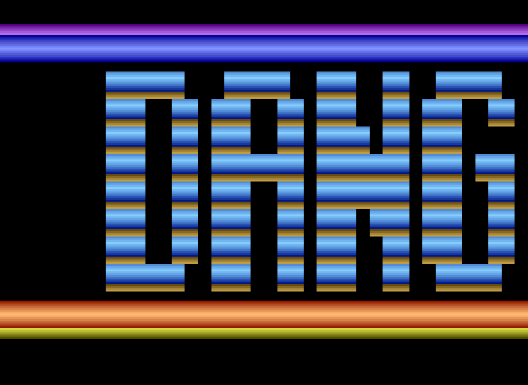
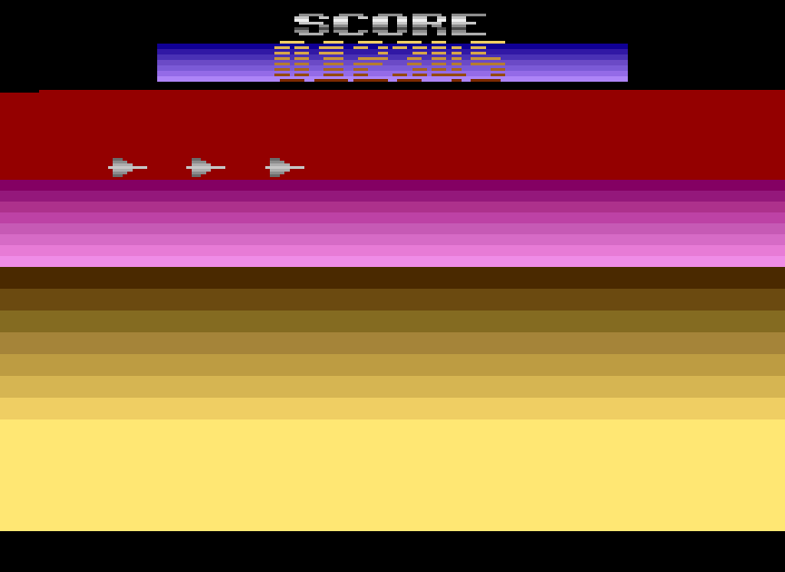

# Danger Zone

A small kernel demo for the Atari 2600

 

## Building

From the command line:

    dasm DangerZone.asm -oDangerZone.bin -f3

Alternatively, the included makefile can be used. Before building, in the makefile adjust the paths `DASM` and (optionally) `STELLA`. To compile just type `make`, or `make run` in order to build and then load the ROM in Stella.

## Links

[DASM](https://github.com/dasm-assembler/dasm) macro assembler

[Stella](https://stella-emu.github.io) Atari 2600 VCS emulator
